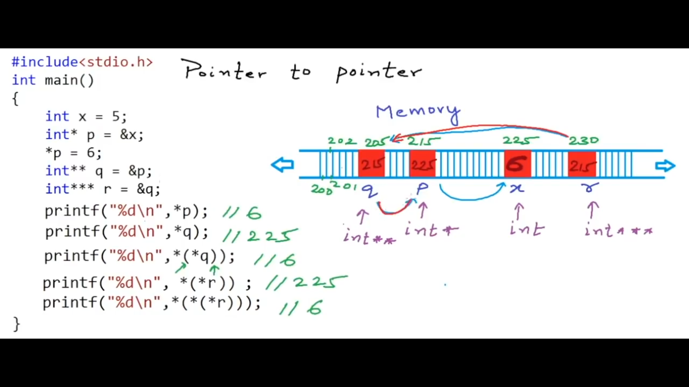
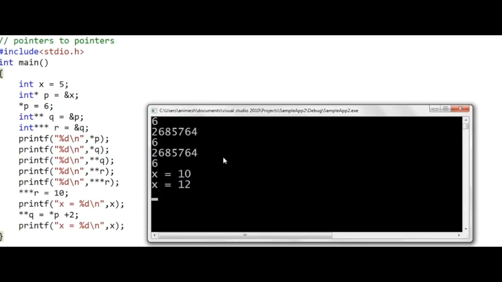

- int - 4 byte
- char - 1 byte
- float - 4 byte

## Pointers : variables that store the address of another variables
````cpp
int a;
int *p;
p = &a;
a = 5;
printf("%d\n",&a); // 204 (address of a)
printf("%d\n",p); // 204 (address of a stored in pointer p)
printf("%d\n",&p); // 64 (address of pointer p itself)
printf("%d\n",*p); // 5 (value stored in a)
*p = 8;
printf("%d\n",a); // 8 (value stored in a)
````
> `&` means address of 

> Both `*p = 8;` & `printf("%d\n",*p);` are called `dereferencing` which means
> that I want the value which is stored inside the address that is stored inside pointer `p`

<hr>

````cpp
int a; // integer
int *p; // pointer to integer


char c; // character 
char *p1; // pointer to character

double d; // double
double *p1; //pointer to double

````

### Let's play a little with `pointers`
````cpp
#include <bits/stdc++.h>
using namespace std;
int main()
{
    int a = 10;
    int *p;
    p = &a;
    printf("Address of a is : %d\n",&a);
    printf("Address of p is : %d\n",p); // same as a
    printf("Value at p is : %d\n",*p); // 10
    int b = 20;
    *p = b;
    printf("Value at p is : %d\n",*p); // 20
}
````


````cpp
int main()
{
    int a = 10;
    int *p;
    p = &a;
    printf("Address of p is : %d\n",p); // address : 200
    printf("Address of p+1 is : %d\n",p+1); // address : 204
}
````
### Why `Pointers` are strong types (must specify  the data type of the variable the pointer will refer to) ?
### Why not generic type for `Pointers`?
#### - Why specifying the data type of `Pointers` while its job is to just store the address of another variable
> Let's see, `p+1` means that I want to increase the address by `1`, but since
> this pointer points to an integer then it will increase by `4` bytes (`1`*`4` bytes)
>, that's why we have to specify the data type on which the pointer refers to
> because when the pointer refers to an `integer`, it then knows that each time i will use `p+1` 
> it will increase by `4` bytes
> not like `char` data type for example, it will only increase by `1` byte

> The **second** reason for specify the data type of pointers that it is important in `derefercing`
> , let's assume that `int a` occupies address `200,201,202,203`, then a pointer refering to variable `a`
> will only store first address (`200`), now when I type `printf("%d\n",*p)` this means as we said before
> go to address `200` then print the value stored in it, but in this case the compiler should know the data type of that pointer
> so that if it is an `integer` for example the compiler will know that from address `200` till `203` (Look at `4` bytes starting from address `200`) are all reserved for that variable
> so, it is important to know the data type of the pointer to be able to calculate number of reserved bytes for that variable while both `reading` or `writing` (Access/Modify) from that pointer 

- Let's see the following example, to understand it well
````cpp
int main()
{
    int a = 1025;// 00000000 00000000 00000100 00000001
    int *p;
    p = &a;
    printf("Size of integer %d\n", sizeof(int)); // 4
    printf("Address of p : %d , value of p: %d \n",p,*p); // 200 1025
    char *p0;
    p0 = (char *)p;
    printf("Size of character %d\n", sizeof(char)); // 1
    printf("Address of p0 : %d , value of p0: %d \n",p0,*p0); // 200 1
}
````
> As we can see the value of char pointer `p0` is `1`, but why ? <br>
> Let's observe the binary representation of number 125 <br>
> `00000000 00000000 00000100 00000001` when we was printing `*p` it was referring
> to an integer so that the 4 bytes are all related to that variable, 
> but when we cast the int pointer to char one `p0 = (char *)p;` the pointer  `p0` will again store the address
> of the first byte (same as `p`), but in this time it will only print it while dereferining (access/modify) as it is a char pointer (it takes only 1 byte)
> so that its corresponding value now is `00000001`

> Note: the output is a number even when I accessed a char pointer beacuse of `printf("%d")` that prints only numbers

````cpp
int main()
{
    int a = 1025;
    int *p;
    p = &a;
    printf("Address of a %d\n", &a); //200
    printf("Address of p : %d , value of p: %d \n",p+1,*(p+1)); // 204 garbage
    char *p0;
    p0 = (char *)p; // Typecasting
    printf("Size of character %d\n", sizeof(char)); // 1
    printf("Address of c : %d , value of c: %d \n",p0+1,*(p0+1)); // 201 4
}
````
> The value of `*(p0+1)` is `4` because I have moved `1 byte` so now `p0` refers to `00000100` byte the second byte in <br>
> `00000000 00000000 00000100 00000001` 

````cpp 
printf("Size of int %d\n",sizeof(int));
````


````cpp
int main()
{
    int a = 10;
    int *p;
    p = &a;
    printf("Address of p is : %d\n",p); // address : 200
    printf("Address of p+1 is : %d\n",p+1); // address : 204
    printf("Value at p+1 is : %d\n",*(p+1)); // garbage value
}
````

<hr>
<hr>

### `Void Pointer` : it is used to just store the first address of a variable
#### Without being able to `dereference` or perform any `arithmetic` operation (`+`)
````cpp
int main()
{
    int a = 1025;
    int *p;
    p = &a;
    void *p0;
    p0 = p; // like (void*) p
    printf("Address %d\n",p);
    printf("Address %d\n",p0); // we cannot dereference this pointer
    //printf("Value = %d\n",*p0); // we cannot dereference this pointer
    //printf("Address of next %d\n",p0+1); // we cannot perform any arithmetic operation on this pointer
}
````
> `void` pointers have some use cases will be discussed later


### `Pointer` To `Pointer`
- Let's see the following example:
````cpp
int main()
{
    int x = 5; // address 225
    int *p = &x;
    *p = 6;
    int **q = &p;
    int ***r = &q;
    printf("%d\n",*p); // 6
    printf("%d\n",*q); // 225 (address stored in p)
    printf("%d\n",*(*q)); // 6
    printf("%d\n",*(*r)); //2525
    printf("%d\n",*(*(*r))); //6
    ***r = 10;
    printf("%d\n",x); //10
    **q = *p + 2; // 10 + 2 = 12
    printf("%d\n",x); //12
}
````




### `Pointers` as function arguments (Call By Reference)

- Following code is an example of `Call By Value`
````cpp
#include <bits/stdc++.h>
using namespace std;
void Increment(int a)
{
    a++;
    
}
int main()
{
    int a;
    a = 10;
    Increment(a);
    printf("a = %d\n",a); // 10
}
````
> This is because `a` variable in `Increment()` function is different from
> `a` variable in `main()`, as `a` variable in `Increment()` function is created in the stack frame of this function
> while the other `a` variable in `main()` function is created in the stack frame of `main()`
- To prove that try to print the address of `a` in both functions, the address will be different
````cpp
void Increment(int a)// Called Formal Argument
{
    a++;
    printf("%d" , &a); // 200
}
int main()
{
    int a;
    a = 10;
    Increment(a); // Called Actual Argument
    printf("%d" , &a); // 500
    //printf("a = %d\n",a);
}
````

- To `Pass By Reference`, just write this :
````cpp
void Increment(int *a)
{
    *a= *a + 1;
}
int main()
{
    int a;
    a = 10;
    Increment(&a);
    printf("a = %d\n",a); // 11
}
````


### `Pointers` And `Arrays`
- Observe the folowing code:
````cpp
int main()
{
    int arr[5] = {1,2,3,4,5}; //Address 200 204 208 212 216
    int *p;
    p = &arr[0]; // store address of 200
    printf("%d\n",&arr[4]); // 216
    printf("%d\n",arr); // 200
    printf("%d\n",*arr); // 1
    printf("%d\n",arr+1); // 204
    printf("%d\n",*(arr+1)); // 2
    printf("%d\n",p); // 200
    printf("%d\n",*p); // 1
    printf("%d\n",(p+2)); // 200 + 2*4 = 208
    printf("%d\n",*(p+2)); // 3
    p++; // Allowed
    // arr++; // Error
}
````
> Address At index `i` - `&arr[i]` or `(arr+i)` <br>
> Value At index `i` - `arr[i]` or `*(arr+i)` <br>
> Note: `p++` is allowed, while `arr++` is not allowed

### Array As Function Arguments
- Observe  the following code:
````cpp
#include <bits/stdc++.h>
using namespace std;
void Double(int arr[], int sz) {
    int SZ = sizeof(arr)/sizeof(arr[0]); // 2
    printf("Size of arr %d & Size of arr[0] %d \n",sizeof(arr),sizeof(arr[0]));// 8 4
    for (int i = 0; i < sz; i++) {
        *(arr + i) = *(arr + i) * 2;
        // Or
        // arr[i] = arr[i] * 2;
    }
}
int main() {
    int arr[5] = {1, 2, 3, 4, 5}; //Address 200 204 208 212 216
    int sz = sizeof(arr) / sizeof(arr[0]);
    Double(arr, sz);
    for (int i = 0; i < sz; i++) {
        printf("%d\n", *(arr + i));
    }
}
````

- Some Important points from above code :
    1. When an `array` is passed as a parameter, it is passed by reference not by value
    this means that any change in `Double()` function to `array`'s element will affect the `array` in `main()`
    , when you type `int arr[]` as a parameter in `Double()` function you actually pass the address of first element, so `arrays` will be passed in a function as a parameter is treated like pointers
   this is done to prevent memory wasting if you are passing an `array` with large number of elements, instead of creating another `array` having the same elements, you just can access the same array
    2. `int SZ = sizeof(arr)/sizeof(arr[0]); // 2`, the reason that `SZ` = 2 is that `sizeof(arr)` will be `8`, as this is the size of a `pointer` in modern compilers, so
    don't ever calculate the size of a passed `array` in a function with `sizeof()`, always send the size in another parameter like this `Double(int arr[], int sz)`
    3. Referring to point `2`, you can pass `int *arr` instead of `int arr[]` & still having the same result, but this time you are using a `pointer` that refers to the first byte of first element in the array, but in
     this case you will pass in the `actual parameter` the address of the `array` (base address) like this `Double(arr, sz);`
    4. Lines `*(arr + i) = *(arr + i) * 2;` & `arr[i] = arr[i] * 2;` have the same meaning


### Character `Arrays` & `Pointers`