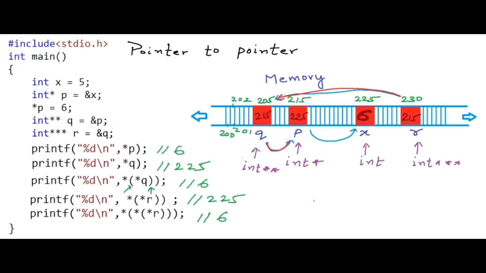

## Master `Pointers` In `C` & `C++`

#### By _Ahmed Mohamed Yousry_ (AKA _Ahmed Arafat_)

### Main Topics To Be Discussed:

1. What Are `Pointers` ?
2. Let's Play A Little With `pointers`
3. Why `Pointers` are strong types?
4. `Void Pointer`
5. `Pointer` To `Pointer`
6. `Pointers` as function arguments (Call By Reference)
7. `Pointers` And `Arrays`
8. Array As Function Arguments
9. Character `Arrays` & `Pointers`
10. `Pointers` & Multi-Dimensional `Arrays`
11. `Pointers` & Dynamic Memory Allocation
12. `Pointers` As Function Return
13. Function `Pointers`
14. Function `Pointers` & Callbacks
15. What Is Memory Leak ?
16. Reference

<hr>

### 1. `Pointers` : They are variables that store the address of another variables

````cpp
int a;
int *p;
p = &a;
a = 5;
printf("%d\n",&a); // 204 (address of a)
printf("%d\n",p); // 204 (address of a stored in pointer p)
printf("%d\n",&p); // 64 (address of pointer p itself)
printf("%d\n",*p); // 5 (value stored in a)
*p = 8;
printf("%d\n",a); // 8 (value stored in a)
````

> `&` means address of

> Both `*p = 8;` & `printf("%d\n",*p);` are called `dereferencing` which means
> that I want the value which is stored inside the address that is stored inside pointer `p`

<hr>

````cpp
int a; // integer
int *p; // pointer to integer


char c; // character 
char *p1; // pointer to character

double d; // double
double *p1; //pointer to double
````

- Remember the memory occupied by each data type

````cpp
- int : 4 bytes
- long : 8 bytes
- char : 1 byte
- float : 4 bytes
````

### 2. Let's play a little with `pointers`

````cpp
#include <bits/stdc++.h>
using namespace std;
int main()
{
    int a = 10;
    int *p;
    p = &a;
    printf("Address of a is : %d\n",&a);
    printf("Address of p is : %d\n",p); // same as a
    printf("Value at p is : %d\n",*p); // 10
    int b = 20;
    *p = b;
    printf("Value at p is : %d\n",*p); // 20
}
````

````cpp
int main()
{
    int a = 10;
    int *p;
    p = &a;
    printf("Address of p is : %d\n",p); // address : 200
    printf("Address of p+1 is : %d\n",p+1); // address : 204
}
````

### 3. Why `Pointers` are strong types (must specify  the data type of the variable the pointer will refer to) ?

### Why not generic type for `Pointers`?

#### - Why specifying the data type of `Pointers` while its job is to just store the address of another variable

> Let's see, `p+1` means that I want to increase the address by `1`, but since
> this pointer points to an integer then it will increase by `4` bytes (`1`*`4` bytes)
> , that's why we have to specify the data type on which the pointer refers to
> because when the pointer refers to an `integer`, it then knows that each time i will use `p+1`
> it will increase by `4` bytes
> not like `char` data type for example, it will only increase by `1` byte

> The **second** reason for specify the data type of pointers that it is important in `derefercing`
> , let's assume that `int a` occupies address `200,201,202,203`, then a pointer refering to variable `a`
> will only store first address (`200`), now when I type `printf("%d\n",*p)` this means as we said before
> go to address `200` then print the value stored in it, but in this case the compiler should know the data type of that
> pointer
> so that if it is an `integer` for example the compiler will know that from address `200` till `203` (Look at `4` bytes
> starting from address `200`) are all reserved for that variable
> so, it is important to know the data type of the pointer to be able to calculate number of reserved bytes for that
> variable while both `reading` or `writing` (Access/Modify) from that pointer

- Let's see the following example, to understand it well

````cpp
int main()
{
    int a = 1025;// 00000000 00000000 00000100 00000001
    int *p;
    p = &a;
    printf("Size of integer %d\n", sizeof(int)); // 4
    printf("Address of p : %d , value of p: %d \n",p,*p); // 200 1025
    char *p0;
    p0 = (char *)p;
    printf("Size of character %d\n", sizeof(char)); // 1
    printf("Address of p0 : %d , value of p0: %d \n",p0,*p0); // 200 1
}
````

> As we can see the value of char pointer `p0` is `1`, but why ? <br>
> Let's observe the binary representation of number 125 <br>
> `00000000 00000000 00000100 00000001` when we was printing `*p` it was referring
> to an integer so that the 4 bytes are all related to that variable,
> but when we cast the int pointer to char one `p0 = (char *)p;` the pointer  `p0` will again store the address
> of the first byte (same as `p`), but in this time it will only print it while dereferining (access/modify) as it is a
> char pointer (it takes only 1 byte)
> so that its corresponding value now is `00000001`

> Note: the output is a number even when I accessed a char pointer beacuse of `printf("%d")` that prints only numbers

````cpp
int main()
{
    int a = 1025;
    int *p;
    p = &a;
    printf("Address of a %d\n", &a); //200
    printf("Address of p : %d , value of p: %d \n",p+1,*(p+1)); // 204 garbage
    char *p0;
    p0 = (char *)p; // Typecasting
    printf("Size of character %d\n", sizeof(char)); // 1
    printf("Address of c : %d , value of c: %d \n",p0+1,*(p0+1)); // 201 4
}
````

> The value of `*(p0+1)` is `4` because I have moved `1 byte` so now `p0` refers to `00000100` byte the second byte
> in <br>
> `00000000 00000000 00000100 00000001`

````cpp 
printf("Size of int %d\n",sizeof(int));
````

````cpp
int main()
{
    int a = 10;
    int *p;
    p = &a;
    printf("Address of p is : %d\n",p); // address : 200
    printf("Address of p+1 is : %d\n",p+1); // address : 204
    printf("Value at p+1 is : %d\n",*(p+1)); // garbage value
}
````

<hr>
<hr>

### 4. `Void Pointer` : it is used to just store the first address of a variable

#### Without being able to `dereference` or perform any `arithmetic` operation (`+`)

````cpp
int main()
{
    int a = 1025;
    int *p;
    p = &a;
    void *p0;
    p0 = p; // like (void*) p
    printf("Address %d\n",p);
    printf("Address %d\n",p0); // we cannot dereference this pointer
    //printf("Value = %d\n",*p0); // we cannot dereference this pointer
    //printf("Address of next %d\n",p0+1); // we cannot perform any arithmetic operation on this pointer
}
````

> `void` pointers have some use cases will be discussed later

### 5. `Pointer` To `Pointer`

- Let's see the following example:

````cpp
int main()
{
    int x = 5; // address 225
    int *p = &x;
    *p = 6;
    int **q = &p;
    int ***r = &q;
    printf("%d\n",*p); // 6
    printf("%d\n",*q); // 225 (address stored in p)
    printf("%d\n",*(*q)); // 6
    printf("%d\n",*(*r)); //2525
    printf("%d\n",*(*(*r))); //6
    ***r = 10;
    printf("%d\n",x); //10
    **q = *p + 2; // 10 + 2 = 12
    printf("%d\n",x); //12
}
````




### 6. `Pointers` as function arguments (Call By Reference)

- Following code is an example of `Call By Value`

````cpp
#include <bits/stdc++.h>
using namespace std;
void Increment(int a)
{
    a++;
    
}
int main()
{
    int a;
    a = 10;
    Increment(a);
    printf("a = %d\n",a); // 10
}
````

> This is because `a` variable in `Increment()` function is different from
> `a` variable in `main()`, as `a` variable in `Increment()` function is created in the stack frame of this function
> while the other `a` variable in `main()` function is created in the stack frame of `main()`

- To prove that try to print the address of `a` in both functions, the address will be different

````cpp
void Increment(int a)// Called Formal Argument
{
    a++;
    printf("%d" , &a); // 200
}
int main()
{
    int a;
    a = 10;
    Increment(a); // Called Actual Argument
    printf("%d" , &a); // 500
    //printf("a = %d\n",a);
}
````

- To `Pass By Reference`, just write this :

````cpp
void Increment(int *a)
{
    *a= *a + 1;
}
int main()
{
    int a;
    a = 10;
    Increment(&a);
    printf("a = %d\n",a); // 11
}
````

### 7. `Pointers` And `Arrays`

- Observe the following code:

````cpp
int main()
{
    int arr[5] = {1,2,3,4,5}; //Address 200 204 208 212 216
    int *p;
    p = &arr[0]; // store address of 200
    printf("%d\n",&arr[4]); // 216
    printf("%d\n",arr); // 200
    printf("%d\n",*arr); // 1
    printf("%d\n",arr+1); // 204
    printf("%d\n",*(arr+1)); // 2
    printf("%d\n",p); // 200
    printf("%d\n",*p); // 1
    printf("%d\n",(p+2)); // 200 + 2*4 = 208
    printf("%d\n",*(p+2)); // 3
    p++; // Allowed
    // arr++; // Error
}
````

> Address At index `i` - `&arr[i]` or `(arr+i)` <br>
> Value At index `i` - `arr[i]` or `*(arr+i)` <br>
> Note: `p++` is allowed, while `arr++` is not allowed

### 8. Array As Function Arguments

- Observe the following code:

````cpp
#include <bits/stdc++.h>
using namespace std;
void Double(int arr[], int sz) {
    int SZ = sizeof(arr)/sizeof(arr[0]); // 2
    printf("Size of arr %d & Size of arr[0] %d \n",sizeof(arr),sizeof(arr[0]));// 8 4
    for (int i = 0; i < sz; i++) {
        *(arr + i) = *(arr + i) * 2;
        // Or
        // arr[i] = arr[i] * 2;
    }
}
int main() {
    int arr[5] = {1, 2, 3, 4, 5}; // Address 200 204 208 212 216
    int sz = sizeof(arr) / sizeof(arr[0]);
    Double(arr, sz);
    for (int i = 0; i < sz; i++) {
        printf("%d\n", *(arr + i));
    }
}
````

- Some Important points from above code :
    1. When an `array` is passed as a parameter, it is passed by reference not by value
       this means that any change in `Double()` function to `array`'s element will affect the `array` in `main()`
       , when you type `int arr[]` as a parameter in `Double()` function you actually pass the address of first element,
       so `arrays` will be passed in a function as a parameter is treated like pointers
       this is done to prevent memory wasting if you are passing an `array` with large number of elements, instead of
       creating another `array` having the same elements, you just can access the same array
    2. `int SZ = sizeof(arr)/sizeof(arr[0]); // 2`, the reason that `SZ` = 2 is that `sizeof(arr)` will be `8`, as this
       is the size of a `pointer` in modern compilers, so
       don't ever calculate the size of a passed `array` in a function with `sizeof()`, always send the size in another
       parameter like this `Double(int arr[], int sz)`
    3. Referring to point `2`, you can pass `int *arr` instead of `int arr[]` & still having the same result, but this
       time you are using a `pointer` that refers to the first byte of first element in the array, but in
       this case you will pass in the `actual parameter` the address of the `array` (base address) like
       this `Double(arr, sz);`
    4. Lines `*(arr + i) = *(arr + i) * 2;` & `arr[i] = arr[i] * 2;` have the same meaning

### 9. Character `Arrays` & `Pointers`

- In `C` language, size of array must be `>=` number of characters in
  a string `+1`
- This happens because if you defined an array of character like this

````cpp
int main() {
    char C[10];
    C[0] = 'A';
    C[1] = 'r';
    C[2] = 'a';
    C[3] = 'f';
    C[4] = 'a';
    C[5] = 't';
}
````

> Then we have to till the compiler that character `t` is the last character in that array
> (as you can see the `array` is with size 10, but I only occupied 6 characters), so that
> we want to add a null terminator after the last character like this `C[6] = '\0';`

- All functions for string manipulation in `C` expects that strings will
  `null` terminated (using `\0`)

> A Rule: string in `C` has to be ended by `Null` character

- Let's see an example

````cpp
int main() {
    char C[6];
    C[0] = 'A';
    C[1] = 'r';
    C[2] = 'a';
    C[3] = 'f';
    C[4] = 'a';
    C[5] = 't';
    printf("%s",C);
}
````

> O/P: `Arafat0����` <br>
> As you can there is a garbage characters after `Arafat` because we did not specify
> the end of that character array

- To solve this type

````c++
    char C[7];
C[0] = 'A';
C[1] = 'r';
C[2] = 'a';
C[3] = 'f';
C[4] = 'a';
C[5] = 't';
C[6] = '\0'; // Add null character
printf("%s", C);
````

- Functions like `strlen()` will only count the number of characters in the array
  despite the size of that array (`\0` will not be counted), let's see

````cpp
int main() {
    char C[100];
    C[0] = 'A';
    C[1] = 'r';
    C[2] = 'a';
    C[3] = 'f';
    C[4] = 'a';
    C[5] = 't';
    C[6] = '\0';
    int len = strlen(C);
    printf("Length: %d",len); // 6
}
````

> Note : `\0`is not counted in th length of that array of strings + it counts only the characters
> not the size of that array

- You can also initialize an array of characters like this

````cpp
int main() {
    char C[100] = "Arafat";
    int len = strlen(C);
    printf("Length: %d",len);// 6
}
````

> VIP Note : in the above code, `\0` is implicitly exists by the compiler,
> this means that in this case you don't have to write it

- You cannot initialize an array of character after it's declaration,
  something like this

````cpp
int main() {
    char C[100];
    C = "Arafat"; // Error
    // Rather
    C[0] = 'A';
    C[1] = 'l';
    C[2] = 'i';
}
````

- We can write it also like this

````cpp
int main() {
    char C[] = "Arafat"; // Without adding a size
    int len = strlen(C);
    printf("Size In Bytes : %d\n", sizeof(C)); // 7 Bytes
    printf("Length : %d\n",len); // 6
}
````

> Note : the size in bytes of the above `array` will be 7 , this because as we said `Arafat` word
> is `6 Characters * 1 Byte = 6 Bytes` + `1 Byte` (the implicit `\0`) character,
> so then the Total will be `7`

- Observe the following

````cpp
int main() {
    char C[6] = "Arafat";// Compilation Error
}
````

> Because the compiler will force the size of that `array` with minimum size `7` (to be able to add `\0`),
> so that it will give an error

- Another way to initialize an `array` of characters

````cpp
int main() {
    char C[7] = {'A','r','a','f','a','t','\0'};
}
````

> In this way we have to add the null character (`\0`) as it is stored
> explicitly (must be writen by the developer) not implicitly (automatically by the compiler)

- Now let's play a litter with character `arrays` & `pointers`

````cpp
int main() {
    char C[] = "Arafat"; // Address of 200 (A) 201 (r) 202 (a) 203 (f) 204 (a) 205 (t)
    char *c1 = C;// c1 pointer will store the address of 200
    printf("%c\n",c1[1]); // like saying *(c1+1) which is 'r'
    c1[2] = 'z'; // like saying *(c1+2) = 'z'
    printf("%s\n",C); // Arzfat
    // C = c1; // Error
    c1+=2; // Now address = 202
    printf("%c\n",*c1); // z
}
````

- Remember, `Arrays` are always passed to function by reference, which means that
  we pass the base address of that `array` to that function

````cpp
// Using pointer as a parameter
void MyPrintFun1(char *c)
{
    while (*c != '\0') {
        printf("%c", *c);
        c++;
    }
    printf("\n");
}
// Using an array as a parameter
void MyPrintFun2(char c[]) {
    int i = 0;
    while (c[i] != '\0') {
        printf("%c", c[i]);
        i++;
    }
    printf("\n");
}

int main() {
    char C[] = "Arafat";
    MyPrintFun1(C);
    MyPrintFun2(C);
}
````

- Note that in the pointer function, all the following are _correct_

````cpp
while (*c != '\0')
while (c[i] != '\0')
while (*(c+i) != '\0')
````

### 9.2 Character `Arrays` & `Pointers` - Part 2

- You can write an array of characters like this

````cpp
int main() {
    char *C = "Hello"; // this string is stored as a constant in text segment in memory during compilation
    C[0] = 'a'; // This will case a run-time error
    printf("%s",C);
}
````
> In C, when you declare a character pointer and assign it a value using double quotes, such as char *C = "Hello";, the resulting string literal is stored in a read-only memory segment. This means that the memory location where the string is stored cannot be modified. <br>
> The compiler interprets `char* C = "Hello"` as `char C[6] = {'H','e','l','l','o','\0'}`

- If we have a character array & we passed it in a function, we can
  modify this array using this pointer like this

````cpp
void MyPrintFun1(char *c)
{
    c[0] = 'Z'; // Allowed
    while (*c != '\0') {
        printf("%c", *c);
        c++;
    }
    printf("\n");
}

int main() {
    char C[] = "Hello";
    MyPrintFun1(C); // op: Zello
}
````

- Sometimes we want a function that read a string not be able to write or modify
  anything in it, to do so we will pass the parameter as `const` like this `void MyPrintFun1(const char *c)`

````cpp
void MyPrintFun1(const char *c)
{
    c[0] = 'Z'; // Compilation Error
    while (*c != '\0') {
        printf("%c", *c);
        c++;
    }
    printf("\n");
}

int main() {
    char C[] = "Hello";
    MyPrintFun1(C); 
}
````

> Now we can read `C[]` in `MyPrintFun1()` but not writing in it

### 10. `Pointers` & Multi-Dimensional `Arrays`

<h1>Working On It</h1>


### 11. `Pointers` & Dynamic Memory Allocation

- Application's memory can be divided into 4 segments
    - Code (Text)
    - Static/Global Variables
    - Stack : Stores function calls & local variables
    - Heap

- Let's see the following code

````cpp
#include <bits/stdc++.h>
using namespace std;
int total; // Global
int Square(int x) // x is local to Square()
{
    return x * x;
}
int SquareOfSum(int x, int y) // x,y are local to SquareOfSum()
{
    int z = Square(x + y); //  z is local to SquareOfSum()
    return z;
}
int main() {
    int a = 4, b = 8;// a,b are local to main()
    total = SquareOfSum(a, b);
    printf("%d", total);
}
````

- When our program starts, operating system allocates some amount of
  reserved space for stack like `1MB`,but the actual allocation of the stack frame
  happens during run time, and if our call stack goes beyond reserved memory so then this
  will be called `Stack Over Flow`, then our program will crash (can be happened during recursion without adding
  base condition)
- So, there is some limitation inside the stack, the memory cannot be grown once
  allocated to the stack, application cannot request more memory for the stack
  so that the allocation & reallocation in the stack follows a rule, when a function is called
  it is pushed into the top of the stack or removed from the top of the stack
  when the function stops executing
- It is not possible to manipulate the scope of the variable if it is stored in the stack
- Another limitation is that we need to declare a large array as local variable, we need to
  know the size of the array during compile time if we have the scenario where we want to decide
  the size of an array based on a parameter during run time it is a problem for the stack
- Unlike stack, heap's size can vary during the lifetime of a program & there is
  no set rule for allocation and reallocation of memory, a programmer can totally control
- how much memory to use in a heap and to what time he wants to keep the data in the memory,
  and heap can grow as long as there is available space in the system, this is also a dangerous
  thing in heap that we want to be really careful while using heap, heap also can be called `free pool of memory`
- How heap is implemented is decided by operating system, compiler. It is something that can vary
  depending on the computer architecture
- Heap is also called `Dynamic Memory` & using the heap is referred to as
  `Dynamic Memory Allocation`
- To use dynamic memory in `C` Language we need to use 4 functions
    - `malloc()`
    - `calloc()`
    - `realloc()`
    - `free()`
- To use dynamic memory in `C++` we need to know 2 operators
    - `new`
    - `delete`

- Note: in reality the size of the stack is decided by the operating system & the compiler


- Now lets allocated some memory in heap

````cpp
int main() {
    int a;// stored in stack
    int *p;
    p = (int*) malloc(sizeof(int));
    *p = 10;
    // now p will point into another block in heap
    // the previous block still exists in heap
    // to deallocate the memory in heap that is referred by pointer p
    // type free(p);
    free(p);
    p = (int*) malloc(sizeof(int));
    *p = 20;
}
````

> `malloc(sizeof(int))` will return a void pointer to the starting address of block allocated in heap,
> so we need to typecast it like this `(int*)`. Now it will return the address of 200

- It is the responsibility of the programmer to clear anything allocated by him in the heap, and
  it is not needed anymore

- To store an array in the heap in `C` Language type

````cpp
int main() {
    int *p;
    // 4 * 20 = 120 Byte of memory will be allocated in heap
    // and now `p` contains the base address of that array
    p = (int*) malloc(sizeof(int) * 20);
    p[0] = 10;
    p[1] = 20;
    *p = 11; // override 10
    *(p+1) = 21; // override 20
}
````

- To write the above code in `C++`

````cpp
int main() {
    int *p;
    p = new int;
    *p = 10;
    delete p;
    p = new int[20];
    p[0] = 10;
    p[1] = 20;
    *p = 11; // override 10
    *(p + 1) = 21; // override 20
    delete[] p;
}
````

- Let's now see some functions that dynamically allocate memory in `C` Language
- Allocate Block of memory :
    - `malloc()` - signature/definition of it is like : `void * malloc(size_t size)`
        - Its parameter asks you for size of memory blocks in bytes
          & return the address of the first Byte of block that is allocated in heap
        - It itself is a generic function that allocate some size of memory, it does not care
          whether you're allocating this memory to store `char` or `int` or any other datatype.
        - It simply returns a `void pointer` to the starting address
    - `calloc()` - signature/definition of it is like : `void * calloc(size_t num, size_t size)`
        - This means that if you want to allocate an array os size 3 you will type `(int*)malloc(3,sizeof(int))`
        - One main difference between `malloc` & `calloc` is that `malloc` don't initialize the bytes with any values,
          so there might be garbage values, while `calloc` initialize all allocated Bytes to 0
    - `realloc()` - signature/definition of it is like : `void* realloc(void *ptr,size_t size)`
        - The first argument is a pointer to starting address of existing block & the second
          argument is the size of new block
- Deallocate Block of memory :
    - `free()`

> `size_t` is a datatype that stores positive integer only like `unsigned`,
> the size cannot be 0 or any negative value <br>

> Remember: you cannot de-referencing a void pointer as it is a generic pointer type, so that we have to typecast it

> In `realloc` function, if the new size is greater than the old one, here the compiler see if it can extend the old
> block it will do that
> otherwise it will create another block of memory with new size and then copy all the bytes of the old block to it &
> then free the old block

- Now Let's write some code

````cpp
int main() {
    int n;
    printf("Enter size of the array\n");
    scanf("%d", &n);
    int *arr = (int *) malloc(n * sizeof(int));
    for (int i = 0; i < n; i++) {
        arr[i] = i + 1;
    }
    for (int i = 0; i < n; i++) {
        printf("%d ", arr[i]);
    }
}
````

- Remove initialize loop to see the value of the array

````cpp
int main() {
    int n;
    printf("Enter size of the array\n");
    scanf("%d", &n);
    int *arr = (int *) malloc(n * sizeof(int));
    for (int i = 0; i < n; i++) {
        printf("%d ", arr[i]);
    }
}
````

> O/P: `-957605056 324 -957611696 324 0`, as you can see it is garbage value

- Now use the function `calloc()` to observe how it initializes the bytes to zero

````cpp
int main() {
    int n;
    printf("Enter size of the array\n");
    scanf("%d", &n);
    int *arr = (int *) calloc(n,sizeof(int));
    for (int i = 0; i < n; i++) {
        printf("%d ", arr[i]);
    }
}
````

> O/P: `0 0 0 0 0`

- Now let's see if we used `free()` function then we tried to access that array

````cpp
int main() {
    int n;
    printf("Enter size of the array\n");
    scanf("%d", &n);
    int *arr = (int *) calloc(n, sizeof(int));
    free(arr);
    for (int i = 0; i < n; i++) {
        printf("%d ", arr[i]);
    }
}
````

> O/P: `-199091392 707 -199098032 707 0`

> As you can see we can access that array even if the memory is freed,
> this is because pointer `arr` still refer to the same block ( it refers to the base address of the array)
> even if the memory is freed (as you stored in that pointer the address) <br>
> We can also access the array even after using `free()` function like this
> `arr[2] = 10;` but this line may cause crash in some machines <br>
> To prevent access that block of memory again type `arr = NULL;`, Now we cannot refer to that array anymore
> as the pointer `arr` now is referring to `NULL` <br>
> So, the purpose of using `free()` is that the compiler will be able to reallocate the released
> memory again in any other variable

- Now let's use `realloc()` function

````cpp
int main() {
    int n;
    printf("Enter size of the array\n");
    scanf("%d", &n);
    int *arr = (int *) malloc(n*sizeof(int));
    for (int i = 0; i < n; i++) {
        arr[i] = i+1;
    }
    int *arr2 = (int*) realloc(arr,n*2*sizeof(int));
    printf("Address of arr %d , Address of arr2 %d\n",arr,arr2);
    for (int i = 0; i < n*2; i++) {
        printf("%d ", arr2[i]);
    }
}
/*
O/P:
Address of arr -9430176 , Address of arr2 -9430176
1 2 3 4 5 -1163005939 -1163005939 -1163005939 -1163005939 -1163005939
 */
````

> As you can see in this case, the old block of code is extended to store more elements, that's because the address
> of `arr2` is like address `arr` <br>
> to reduce the array's size we can type `int *arr2 = (int*) realloc(arr,(n/2)*sizeof(int));` <br>
> `Note #1` : `arr = (int*) realloc(arr,0);` is like saying `free(arr)` <br>
> `Note #2` : `int *arr = (int*) realloc(NULL,n*size(int));` is like saying `int *arr = (int*) malloc(n*size(int));`

### 12. `Pointers` As Function Return

- Pointers are just another data type, so we can use them as a return type for a function

- Let's see again an example of passing a parameter by value

````cpp
int Add(int a, int b) // Called function
{
    int c = a + b;
    return c;
}
int main() { // Calling function
    int a = 2 , b = 6;
    printf("Address of a in main : %d\n",&a);
    // value of a in main() is copied to value of a in Add()
    // value of b in main() is copied to value of b in Add()
    int c = Add(a,b);// Call by value
    printf("Sum = %d\n",c);
}
````

- What if we want to make function `Add()` returns the address of `c` rather than returning the value

````cpp
int* Add(int *a, int *b) // Called function
{
    int c = *a + *b;
    return &c;
}
int main() { // Calling function
    int a = 2 , b = 6;
    int *c = Add(&a,&b);// Call by reference
    printf("Sum = %d\n",*c);
}
````

> the following code may or may not work depending on your compiler, but the following code will
> not work definitely

````cpp
void PrintHello()
{
    printf("Hello Arafat\n");
}
int* Add(int *a, int *b) // Called function
{
    int c = *a + *b;
    return &c;
}
int main() { // Calling function
    int a = 2 , b = 6;
    int *c = Add(&a,&b);// Call by reference
    PrintHello();
    printf("Sum = %d\n",*c);
}
````

> Why?, Because `c` variable is a local variable to the function `Add()`,
> which means that is has been created inside its stack frame, so we are returning its address
> which located inside its frame, but after the function `Add()` is terminated &
> the other function `PrintHello()` is called, its stack frame will be created
> instead of the terminated `Add()` function, so that the address of `c` may during this call
> be overridden as it is now in stack frame of `PrintHello()` function, so that it won't work & if it works in some
> compilers then
> the value of address of `c` will be garbage value

- To solve this problem we will have to create the variable `c` in heap not stack like this :

````cpp
void PrintHello()
{
    printf("Hello Arafat\n");
}
int* Add(int *a, int *b) // Called function
{
    int *c = new int; // allocate c in heap
    // In C Language
    //int *c = (*int) malloc(sizeof(int)); // allocate c in heap
    *c = *a + *b;
    return c;
}
int main() { // Calling function
    int a = 2 , b = 6;
    int *c = Add(&a,&b);// Call by reference
    PrintHello();
    printf("Sum = %d\n",*c); // O/P : 8
}
````

- Bottom line, it is okay to pass a pointer (address) from bottom to top
  (from `main()` to `Add()`), because it is a guarantee that `main()` is still occupying the stack,
  but passing a pointer (address) from top to bottom (from `Add()` to `main()`) is wrong
  as `Add()` sooner or later will be deallocated from the memory and its stack frame might be replaced by any
  other called function

### 13. Function `Pointers`

- Function pointers is used to store the address of functions
- So, pointers can point to data & can point to function
- We can use a pointer to function to dereference & execute that function
- But the question here is what really is the address of a function & what is the use-cases ?


- In memory the function will be one contiguous block of some instructions,
  the address of a function which is also called `entry point` of a function will
  be the address of first instruction int that function (address 2016 in below picture)
- when we say function pointers, we mean pointers that store the starting address or
  `entry point` of block of memory contains all instructions for that function

- Let's see the syntax of writing the function `pointers`
````cpp
int Add(int a, int b)
{
    return a + b;
}
int* Add1(int a, int b)
{
    int *c = new int;
    *c = a+b;
    return c;
}
int main() {
    //int is the return type of the function this pointer will refer to
    //(int,int) is the data type of the function this pointer will refer to
    int (*p)(int,int);
    // the return type of the function this pointer will refer to is pointer to int
    int* (*p2)(int,int);
    p = &Add;
    // p = Add; // function name will return the address of it
    int c = (*p)(5,10); // de-referencing and executing the function
    c = p(5,10); // correct
    printf("Sum = %d",c);
}
````
- Let's observe some Compilation Errors with function `Pointers`
````cpp
int Add(int a, int b)
{
    return a + b;
}
int main() {
    void (*p)(int,int);
    p = &Add; // Compile Error as Add() returns int not void
}
````
- Another example :
````cpp
int Add(int a, int b)
{
    return a + b;
}
int main() {
    int (*p)(int);
    p = &Add;
    int c = p(2,3); // Compilation Error as pointer p refers to a function that takes only one parameter not two
}
````
- Let's practice writing a function `pointer` to a `void` function
````cpp
void PrintHello()
{
    printf("Hello Arafat\n");
}
int main() {
    void (*ptr)();
    ptr = PrintHello;
    ptr(); // (*ptr)();
}
````
- Let's practice writing a function `pointer` to a `void` function that takes `char *` as a parameter
````cpp
void PrintHello(char *c)
{
    printf("Hello %s\n",c);
}
int main() {
    void (*ptr)(char *);
    ptr = PrintHello; // ptr = &PrintHello;
    ptr("Arafat"); // (*ptr)("Arafat");
}
````
> In  Function `Pointers` & Callbacks part, we will see the real use-cases of function `pointer`

### 14. Function `Pointers` & Callbacks

````cpp
#include <bits/stdc++.h>
using namespace std;
void Swap(int *a, int *b) {
    int c = *a;
    *a = *b;
    *b = c;
}
void BubbleSort(int *arr, int n) {
    for (int i = 0; i < n; i++)
    {
        for (int j = 0; j < n - 1 - i; j++) {
            if (arr[j] > arr[j + 1]) Swap(&arr[j], &arr[j + 1]);
        }
    }
}
int main() {
    int arr[] = {5, 4, 3, 2, 1};
    int n = sizeof(arr) / sizeof(arr[0]);
    BubbleSort(arr, n);
    for (int i = 0; i < n; i++) printf("%d ", arr[i]);
}
````

````cpp
#include <bits/stdc++.h>
using namespace std;
void Swap(int *a, int *b) {
    int c = *a;
    *a = *b;
    *b = c;
}
int Compare(int a, int b)
{
    return a > b ? 1 : 0 ;
}

void BubbleSort(int *arr, int n, int (*ptr)(int,int)) {
    for (int i = 0; i < n; i++) // 5 4 3 2 1
    {
        for (int j = 0; j < n - 1 - i; j++) {
            if (ptr(arr[j],arr[j + 1]) > 0) Swap(&arr[j], &arr[j + 1]);
        }
    }
}

int main() {
    int arr[] = {5, 4, 3, 2, 1};
    int n = sizeof(arr) / sizeof(arr[0]);
    BubbleSort(arr, n,Compare);
    for (int i = 0; i < n; i++) printf("%d ", arr[i]);
}
````

````cpp
#include <bits/stdc++.h>
using namespace std;
void Swap(int *a, int *b) {
    int c = *a;
    *a = *b;
    *b = c;
}
int CompareASC(int a, int b)
{
    return a > b ? 1 : 0 ;
}

int CompareDESC(int a, int b)
{
    return a < b ? 1 : 0 ;
}


int CompareABS(int a, int b)
{
    return abs(a) > abs(b) ? 1 : 0 ;
}

void BubbleSort(int *arr, int n, int (*ptr)(int,int)) {
    for (int i = 0; i < n; i++) // 5 4 3 2 1
    {
        for (int j = 0; j < n - 1 - i; j++) {
            if (ptr(arr[j],arr[j + 1]) > 0) Swap(&arr[j], &arr[j + 1]);
        }
    }
}

int main() {
    int arr[] = {5, 4, 3, 2, 1};
    int n = sizeof(arr) / sizeof(arr[0]);
    BubbleSort(arr, n,CompareDESC);
    //BubbleSort(arr, n,CompareASC);
    //BubbleSort(arr, n,CompareABS);
    for (int i = 0; i < n; i++) printf("%d ", arr[i]);
}
````

````cpp
int MyCompare(const void *a, const void *b)
{
    int A = *((int*)a); // Typecasting to int then getting the value
    int B = *((int*)b); // Typecasting to int then getting the value
    // it will return a positive number if A ranked higher than B (In this case it will swap as returned number is positive)
    // it will return a negative number if A ranked lower than B
    // it will return ZERO if A has the same rank as B
    return A-B;
    //return B-A;
    //return abs(A)-abs(B);
}
int main() {
    int arr[] = {5, 4, 3, 2, 1};
    int n = sizeof(arr) / sizeof(arr[0]);
    qsort(arr,n,sizeof(int),MyCompare);
    for (int i = 0; i < n; i++) printf("%d ", arr[i]);
}
````
> VIP Note: The advantage of using function pointer in the above codes is that I'm not
> modifying any lines in the function `BubbleSort()`, the only thing I'm changing is while calling this function
> in `main()` like this `BubbleSort(arr, n,CompareDESC);`, I'm just changing the name of passed function so then 
> in this case the function pointer `ptr` will refer to the passed function allowing me to just call that function using my pointer `ptr`
> (again without modifying any code in function `BubbleSort()), this will help me making my code reusable 
> & becoming a `clean code`

### 15. What Is Memory Leak ? 
- This phenomenon happened due to improper use of dynamic memory (memory in the heap)
- As we said before we can free memory in heap using function `free()` in `C` Language & operator `delete` in `C++`

- Let's create a simple game called `Simple Betting Game`
- The computer will shuffle `Jack Queen King` cards
- The player has to guess the position of the `Queen`
- If he wins, he takes `3 * bet`
- If he looses, he will lose the bet amount
- Player has `100 L.E` initially 

<br>

- Let's write the code of this game :)
````cpp
// Created by Ahmed Arafat on 1/10/2023.
#include <bits/stdc++.h>
using namespace std;
int cash = 100, bet;
void play() {
    printf("Shuffling The Cards .....\n");
    Here:
    printf("Please Enter The Position Of The Queen 1,2 or 3");
    int user_pos, pos;
    scanf("%d", &user_pos);
    if (!(user_pos >= 1 && user_pos <= 3)) {
        printf("Please Enter A Valid Number\n");
        goto Here;
    }
    user_pos--;
    srand(time(NULL));
    pos = rand() % 3;
    if (pos == user_pos) {
        printf("You Win ! Congratulations\n");
        cash += 3 * bet;
    } else {
        printf("Wrong Guessing The Position Of The Queen Was %d\n", pos + 1);
        cash -= bet;
    }
    printf("Your Cash Now : %d L.E\n", cash);
}

int main() {
    while (cash) {
        printf("What Is Your Bet?\n");
        scanf("%d", &bet);
        if (bet > cash) printf("You Only Have %d L.E\n", cash);
        else if (bet <= 0) printf("Enter A Positive Number Please\n");
        else
        {
            play();
            printf("\n*************************\n");
        }
    }
}
````
- You can modify the function `play()` like this
````cpp
void play() {
    char Cards[] = {'Q', 'K', 'J'};
    printf("Shuffling The Cards .....\n");
    Here:
    printf("Please Enter The Position Of The Queen 1,2 or 3");
    int user_pos, pos;
    scanf("%d", &user_pos);
    if (!(user_pos >= 1 && user_pos <= 3)) {
        printf("Please Enter A Valid Number\n");
        goto Here;
    }
    srand(time(NULL));
    for (int i = 0; i < 10; i++) {
        int x = rand() % 3;
        int y = rand() % 3;
        int temp = Cards[x];
        Cards[x] = Cards[y];
        Cards[y] = Cards[temp];
    }
    if (Cards[--user_pos] == 'Q') {
        printf("You Win ! Congratulations\n");
        cash += 3 * bet;
    } else {
        printf("Wrong Guessing \n");
        cash -= bet;
    }
    printf("Your Cash Now : %d L.E\n", cash);
}
````
> The memory consumption from the above code will be the same as time run, but if we modified it to be something like this
````cpp
void play() {
    char *Cards = (char *) malloc(3 * sizeof(char));
    Cards[0] = 'Q';
    Cards[1] = 'K';
    Cards[2] = 'J';
        ......
        ......
}
````
> Each time we call function `play()` we allocate a memory in heap, which will cause a memory lack
> because we are not deallocating this block of memory, to solve this we have to write `free(Cards)`
> at the end of the function `play()


## Reference
[Click Me](https://youtu.be/zuegQmMdy8M)
